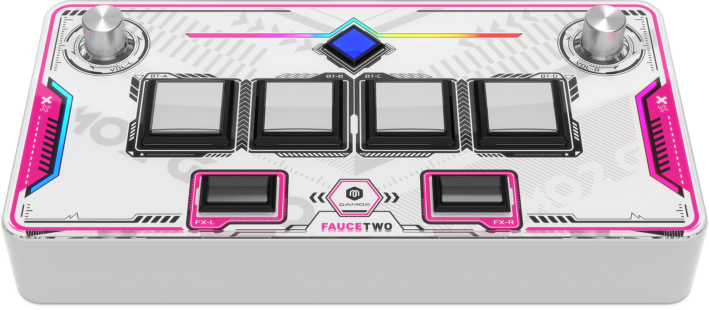
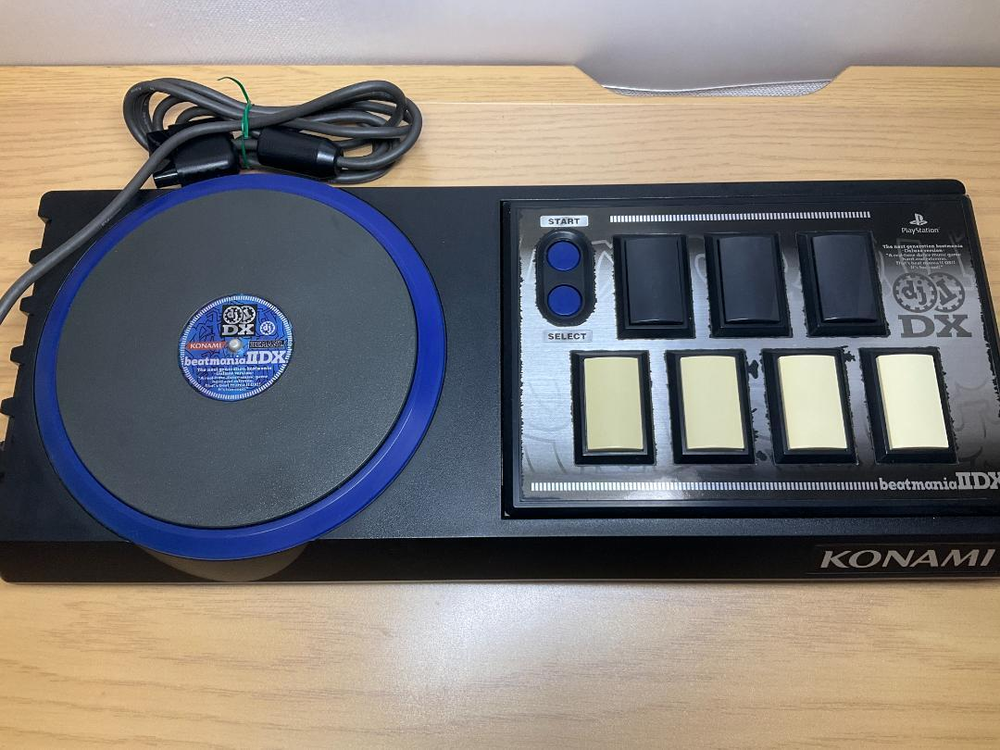

# Mood Board
This will cover a range of arcade rhythm game (ARG) controllers, from different games and makes, and analyse them to establish their use and design choices.
## Sound Voltex

This is the FAUCETWO SDVX controller, which is a portable version of the controls for the arcade rhythm game "Sound Voltex", which is where my inspiration mainly came from. 
It features two "Aux Lane" knobs, with six square buttons for the normal lanes, positioned according to the official arcade cabinet layout.
The design is iconic within the rhythm gaming scene and is the basis for many other portable controllers, which are typically used to allow people to play the game at home on their own computers using an emulator rather than having to go to an arcade to play, saving them money in the long term and allowing the playing of custom levels without a modified machine.

## Beatmania IIDX

This is the Playstation accessory for the game "Beatmania IIDX", which is a game in the "Beatmania" series. 
It has ports for various different consoles, but is also an arcade game. 
The control layout for this game features seven note buttons on one side, and a "Scratch Lane" on the other, and while they are shown on the right and left respectively, they appear in various orientations across the series, and it also depends if you are P1 or P2 on the cabinets.
This design uses more rectangular buttons due to it having more of them, and the piano key like layout. To save space and make the game easier to play.

