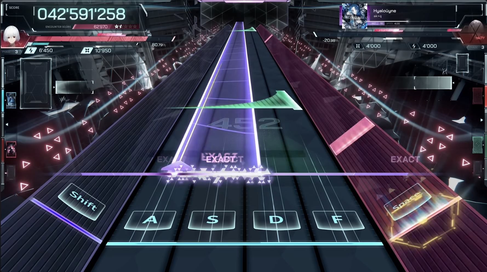

# Design Breif
## Goal 
To design a solution to a problem, and create it within the real world.

## Problem ##
There is no largely available controller for the rhythm game "In Falsus", as it utilises unique controls which makes it tricky to play with a traditional playstyle.

## Solution ##
To design and make a controller using cad and a variety of lazer cutting and 3d printing to 

# About the game
In Falsus is a game by Lowiro, most well known for making hit game Arcaea, In Falsus features similar gimmicks to the afformentioned game, such as a dynamic "Sky Lane" input.
While not released yet, In Falsus has an available demo for early access on steam and it's strange/unique playstyle leaves players experimenting with various controlller to find a comfortable and effective form.

This is a sample of In Falsus gameplay, taken from the official Lowiro In Falsus gameplay preview video.
This shows it's strange design as you must use one hand to play the 6K (6 key) rhythm game, as well as using your other hand to control the mouse to hit the "Sky Notes" at the top of the screen. 
This can be quite strange, as you have to move your fingers to hit 6 keys with one hand at times, and you are restricted to one hand gameplay, as you cannot use mouse keys as part of the rhythm game.
Some people would say "Skill Issue". I choose to ignore them. And so I am designing a controller for In Falsus. Both as a proof of concept, and a genuine product I, and others could use.

[This is the link to the original video, I couldn't embed it in a markdown file.](https://www.youtube.com/watch?v=hrt9R8ZYOAM)

[Back](README.md)
